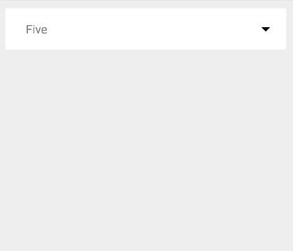

# Nice Spinner

NiceSpinner is a re-implementation of the default Android's spinner, with a nice arrow animation and a different way to display its content.

It follows the material design guidelines, and it is compatible starting from Api 14.



### Usage
The usage is pretty straightforward. Add the tag into the XML layout, then use this snippet to populate with contents:

```sh
 NiceSpinner niceSpinner = (NiceSpinner) findViewById(R.id.nice_spinner);
 List<String> dataset = new LinkedList<>(Arrays.asList("One", "Two", "Three", "Four", "Five"));
 niceSpinner.attachDataSource(dataset);
```

License
----

Apache v2.0
